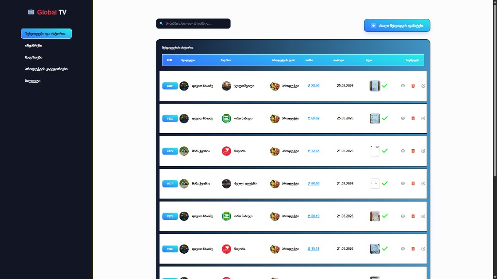
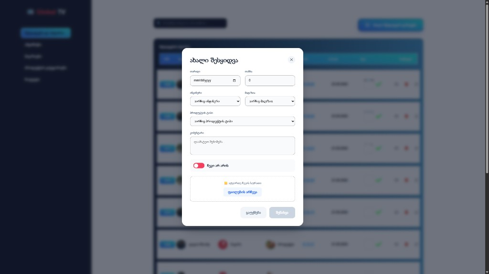

# Global TV — Budget Management System

Angular web app for tracking company purchases, merchants, engineers, product categories, and monthly budgets. UI language is Georgian.

## Screenshots

### Purchase history

Main dashboard: purchase list with buyer avatars, merchant icons, product type, amount (₾), date, receipt thumbnail + status, and view / delete / edit actions.



**What you see**
- Left sidebar: **Global TV** logo and navigation  
  - შესყიდვები და ისტორია (Purchases & history)  
  - ინჟინრები (Engineers)  
  - მაღაზიები (Merchants)  
  - პროდუქტის კატეგორიები (Product categories)  
  - ბიუჯეტი (Budget)
- Search by name or amount
- **ახალი შესყიდვის დამატება** — add a new purchase
- Table columns: `#ID`, მყიდველი, მაღაზია, პროდუქტის ტიპი, თანხა, თარიღი, ჩეკი, მოქმედება
- Receipt column shows the uploaded check image thumbnail and a green check / red X

### New purchase modal

Form to create a purchase with optional receipt upload.



**Fields**
| Field (KA) | Meaning |
|---|---|
| თარიღი | Purchase date |
| თანხა | Amount |
| ინჟინერი | Buyer / engineer |
| მაღაზია | Merchant / store |
| პროდუქტის ტიპი | Product category |
| კომენტარი | Optional note |
| ჩეკი არის / არ არის | Receipt present toggle |
| ატვირთეთ ჩეკის სურათი | Upload receipt image file(s) |

Actions: **გაუქმება** (Cancel), **შენახვა** (Save).

## Features

- Purchase history with search, pagination, and CRUD
- Engineer profiles with avatar upload
- Merchants and product categories with icons
- Monthly budget tracking
- Receipt file upload / download / preview (fullscreen)
- Click engineer avatar in the list to open full-size image

## Tech stack

- Angular 17 (standalone components, SSR)
- Bootstrap 5
- RxJS
- REST API backend (`FileControllers`, `PurchaseHistory`, `Enginner`, `Merchant`, `ProductType`, `MonthBudget`, `EngineerProfile`)

## Getting started

```bash
npm install
ng serve
```

Open `http://localhost:4200/`.

### Build

```bash
ng build
```

Artifacts go to `dist/`.

### SSR serve (after build)

```bash
npm run serve:ssr:Global-TV-Budget-Management-System
```

## Project structure (high level)

```
src/app/
  purchase-history/   # purchases list + create/edit/view modals
  enginner/           # engineers + profiles
  merchant/           # stores
  product-type/       # product categories
  month-budget/       # budgets
  services/           # API services
  shared/             # base store, nav config, constants
  model/              # DTOs
```

## Environment

API base URL is set in `src/environment/environment.ts` (e.g. `http://192.168.1.102:1121/api`).
